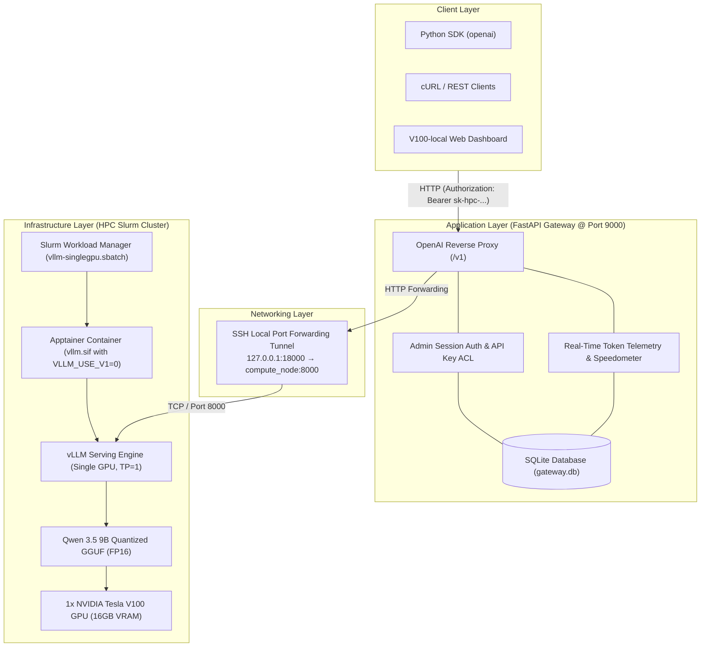

# V100-local — NVIDIA Tesla V100 HPC LLM Architecture & Serving Platform

[](https://fastapi.tiangolo.com)
[](https://github.com/vllm-project/vllm)
[](https://apptainer.org/)
[](https://slurm.schedmd.com/)
[](LICENSE)

An enterprise-grade, full-stack local Large Language Model (LLM) serving and governance platform designed for High-Performance Computing (HPC) environments running GPU clusters (NVIDIA Volta V100, Ampere A100, Hopper H100) managed by Slurm.

---

## 🏗️ Multi-Layer System Architecture



## 🖥️ Dashboard Screenshots

### Telemetry & Models


### Slurm HPC Cluster


### AI Chat Studio


---

## ✨ Key Capabilities

1. **High-Throughput HPC Serving**:
   - Optimized for single-GPU Volta V100 compute nodes using quantized GGUF weights (`Qwen3.5-9B-Q4_K_M.gguf`) occupying only **~5.8 GB VRAM**, leaving **64% VRAM headroom** for ultra-long context KV Caching.
   - Pinned Apptainer container runtime (`vllm.sif`) running without root privileges.

2. **Full Observability & Token Dynamics**:
   - **Real-Time Speedometer**: Measures continuous token generation speed (`tok/s`), Time To First Token (`TTFT`), and end-to-end request latency.
   - **Interactive Chart.js Dashboard**: Dual-axis bar and line charts visualizing tokens generated per minute alongside cumulative token volume.
   - **Inference Audit Ledger**: Complete transaction history recording tokens, latency, status, and client keys.

3. **Slurm Cluster Job Supervision**:
   - Live cluster status polling displaying job IDs, compute nodes, partition state, and execution time directly on the web interface.

4. **AI Chatbot Studio**:
   - Multi-turn conversational playground with persistent dialogue history.
   - Enhanced Markdown rendering with code syntax highlighting (Atom One Dark theme) and 1-click code block copying.

5. **Security & API Key Governance**:
   - **Admin Authentication**: Secure login system with username/password issuing 7-day session tokens (`sess_...`).
   - **Client API Keys**: Issues hashed `sk-hpc-...` tokens with custom Sliding Window Rate Limiting (RPM) and Model Access Control Lists (ACL).

---

## 📁 Repository Structure

```text
local-llm/
├── .env.example                        # Global environment configuration template
├── GUIDE.md                            # Comprehensive HPC deployment guide
├── README.md                           # Project overview & quickstart
├── docs/                               # Comprehensive technical documentation
│   ├── api-descriptions.md             # REST API endpoint specifications
│   ├── api-gateway.md                  # Application gateway & dashboard guide
│   ├── architecture.md                 # System architecture & data flow diagrams
│   └── infrastructure-deployment.md    # HPC, Slurm & Apptainer deployment guide
├── app/                                # Application Gateway & Web App
│   ├── app/                            # FastAPI backend
│   │   ├── __init__.py
│   │   └── main.py                     # Proxy server, metrics collector & auth
│   ├── config/                         # Upstream model routing config
│   │   └── models.json
│   ├── ui/                             # Frontend single-page application
│   │   └── index.html                  # vLLMlocal UI (HTML, Tailwind, Marked, Chart.js)
│   ├── data/                           # Local SQLite database (gateway.db)
│   ├── examples/                       # Python SDK & cURL usage scripts
│   ├── scripts/                        # Launcher & SSH tunnel scripts
│   │   ├── run.sh                      # Gateway launcher
│   │   └── ssh-tunnel.sh               # Port forward helper
│   ├── .env.example                    # Local environment template
│   └── requirements.txt                # Python dependencies
└── infra/                              # HPC Infrastructure & Slurm
    ├── build/                          # Container build directory
    ├── defs/                           # Apptainer definition files (vllm.def)
    ├── logs/                           # Slurm stdout and stderr logs
    └── slurm/                          # Slurm batch submission scripts
        ├── serving/                    # Model serving jobs (vllm-singlegpu.sbatch)
        └── download/                   # Model download jobs (hf_download_qwen9b_gguf.sbatch)
```

---

## 🚀 Quick Start

### 1. Launch vLLM on HPC Compute Node
```bash
cd infra
sbatch slurm/serving/vllm-singlegpu.sbatch
```
Check job node assignment:
```bash
squeue -u $USER
```

### 2. Forward Compute Node Port to Local Machine
```bash
cd app
GPU_NODE=gpunode1.gitc.hpc LOCAL_PORT=18000 ./scripts/ssh-tunnel.sh
```

### 3. Configure Environment & Start Gateway
```bash
# Copy template at root or inside app/
cp .env.example .env

# Launch Gateway server & Web console
cd app
./scripts/run.sh
```
Open **`http://127.0.0.1:9001`** (or your public domain **`https://llm.ledinhduc.id.vn`**) in your browser to access the **vLLMlocal** console.

---

## 📚 Documentation Index

- [API Keys & Model ACL Guide](file:///home/dev/local-llm/docs/api_acl.md)
- [REST API Specifications](file:///home/dev/local-llm/docs/api-descriptions.md)
- [Gateway & Dashboard User Guide](file:///home/dev/local-llm/docs/api-gateway.md)
- [Architecture & Technical Design](file:///home/dev/local-llm/docs/architecture.md)
- [HPC Infrastructure & Slurm Guide](file:///home/dev/local-llm/docs/infrastructure-deployment.md)
