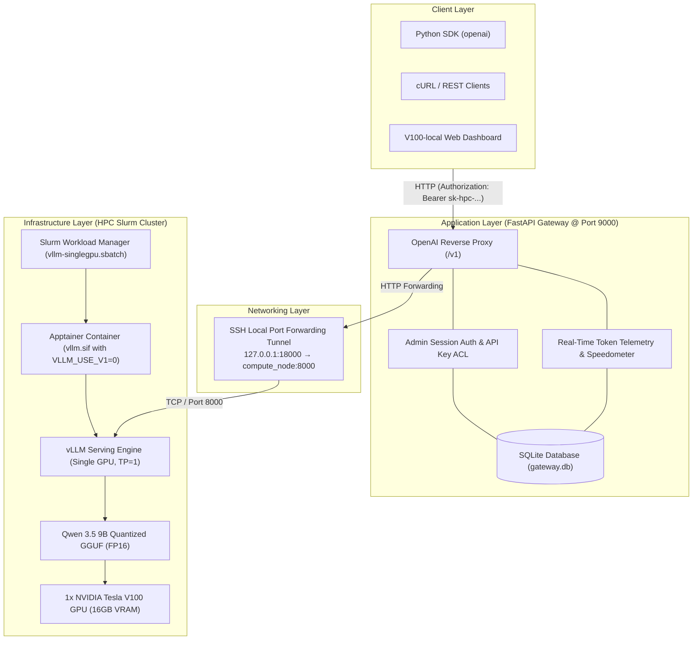
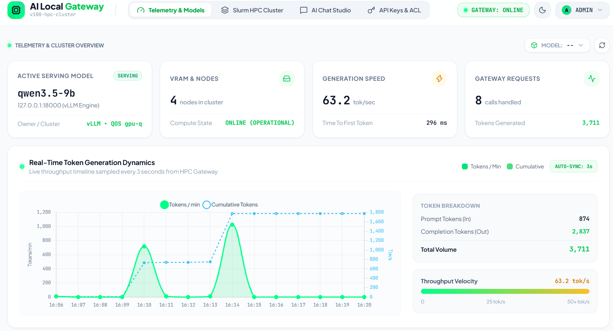
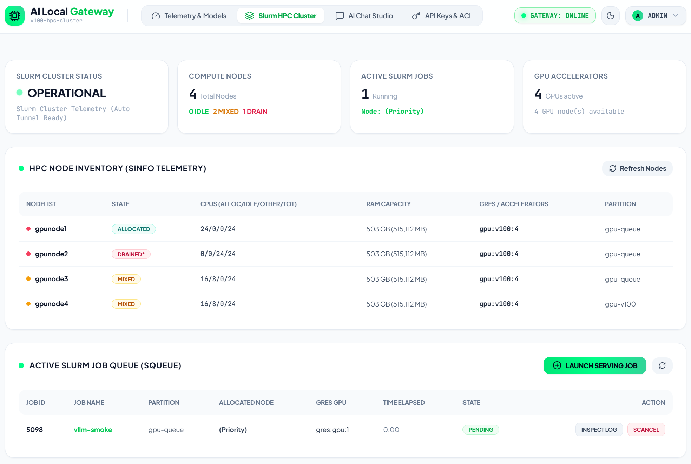
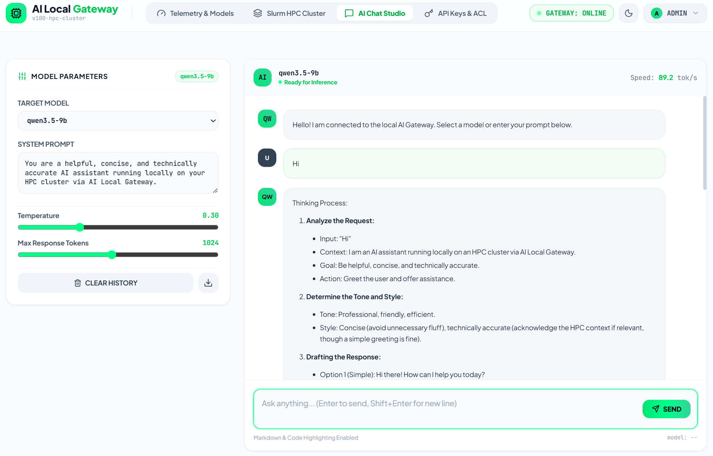

# V100-local — NVIDIA Tesla V100 HPC LLM Architecture & Serving Platform

[](https://fastapi.tiangolo.com)
[](https://github.com/vllm-project/vllm)
[](https://apptainer.org/)
[](https://slurm.schedmd.com/)
[](LICENSE)

An enterprise-grade, full-stack local Large Language Model (LLM) serving and governance platform designed for High-Performance Computing (HPC) environments running GPU clusters (NVIDIA Volta V100, Ampere A100, Hopper H100) managed by Slurm.

---

## 🏗️ Multi-Layer System Architecture



## 🖥️ Dashboard Screenshots

### Telemetry & Models



### Slurm HPC Cluster



### AI Chat Studio



---

## ⚡ Inference Engines & Benchmark on Tesla V100 (SM70)

Tested on **NVIDIA Tesla V100 SXM2 (16GB VRAM, Volta / SM70)** with **Qwen 3.5 9B**:

| Engine Backend | Quantization / Format | Attention & Kernels | Throughput (Generation) | VRAM Footprint | Best Used For |
| :--- | :--- | :--- | :--- | :--- | :--- |
| **`llama.cpp`** | **GGUF** (`Q4_K_M`) | Native CUDA (cuBLAS) | **~80 tok/s** 🚀 | ~5.8 GB (~64% headroom) | Maximum single-stream speed, minimal memory |
| **`1cat-vLLM`** *(vLLM Fork)* | **AWQ** (`INT4`) | `FLASH_ATTN_V100` + TurboMind SM70 | **~55 tok/s** ⚡ | ~7.2 GB (dynamic KV cache) | Batch throughput, continuous batching, prefix caching |

---

## ✨ Key Capabilities

1. **Dual High-Throughput HPC Serving Backends**:
   - **llama.cpp Engine (~80 tok/s)**: Super-fast single-GPU inference utilizing quantized GGUF weights (`Qwen3.5-9B-Q4_K_M.gguf`), occupying only **~5.8 GB VRAM** and leaving ample headroom for deep context windows.
   - **1cat-vLLM Engine (~55 tok/s)**: Production vLLM engineering fork specifically optimized for Tesla V100 (SM70) with `FLASH_ATTN_V100` and TurboMind AWQ (`QuantTrio/Qwen3.5-9B-AWQ`), supporting continuous batching and prefix caching.
   - Pinned Apptainer container runtimes running seamlessly without root privileges on Slurm compute nodes.

2. **Full Observability & Token Dynamics**:
   - **Real-Time Speedometer**: Measures continuous token generation speed (`tok/s`), Time To First Token (`TTFT`), and end-to-end request latency.
   - **Interactive Chart.js Dashboard**: Dual-axis bar and line charts visualizing tokens generated per minute alongside cumulative token volume.
   - **Inference Audit Ledger**: Complete transaction history recording tokens, latency, status, and client keys.

3. **Slurm Cluster Job Supervision & Resilient Reverse Tunneling**:
   - Live cluster status polling displaying job IDs, compute nodes, partition state, and execution time directly on the web interface.
   - Built-in automatic keep-alive reverse SSH tunnels connecting GPU compute nodes to Gateway nodes.

4. **AI Chatbot Studio**:
   - Multi-turn conversational playground with persistent dialogue history.
   - Enhanced Markdown rendering with code syntax highlighting (Atom One Dark theme) and 1-click code block copying.

5. **Security & API Key Governance**:
   - **Admin Authentication**: Secure login system with username/password issuing 7-day session tokens (`sess_...`).
   - **Client API Keys**: Issues hashed `sk-hpc-...` tokens with custom Sliding Window Rate Limiting (RPM) and Model Access Control Lists (ACL).

---

## 📁 Repository Structure

```text
local-llm/
├── .env.example                        # Global environment configuration template
├── GUIDE.md                            # Comprehensive HPC deployment guide
├── README.md                           # Project overview & quickstart
├── docs/                               # Comprehensive technical documentation
│   ├── api-descriptions.md             # REST API endpoint specifications
│   ├── api-gateway.md                  # Application gateway & dashboard guide
│   ├── architecture.md                 # System architecture & data flow diagrams
│   └── infrastructure-deployment.md    # HPC, Slurm & Apptainer deployment guide
├── app/                                # Application Gateway & Web App
│   ├── app/                            # FastAPI backend (proxy, telemetry & auth)
│   ├── config/                         # Upstream model routing config (models.json)
│   ├── ui/                             # Frontend SPA (HTML, Tailwind, Marked, Chart.js)
│   ├── data/                           # Local SQLite database (gateway.db)
│   ├── examples/                       # Python SDK & cURL usage scripts
│   └── scripts/                        # Launcher & SSH tunnel scripts
└── infra/                              # HPC Infrastructure, Backends & Slurm
    ├── 1cat-vllm/                      # 1Cat-vLLM backend (~55 tok/s, FLASH_ATTN_V100, AWQ)
    │   ├── defs/                       # Container definitions (1cat_vllm.def)
    │   ├── slurm/                      # Serving & download batch scripts
    │   └── run_qwen_1cat.sbatch        # Standalone 1Cat serving job
    ├── llama-cpp/                      # llama.cpp backend (~80 tok/s, GGUF Q4_K_M)
    └── vllm/                           # Standard vLLM backend & benchmarks
```

---

## 🚀 Quick Start

### 1. Launch vLLM on HPC Compute Node
```bash
cd infra
sbatch slurm/serving/vllm-singlegpu.sbatch
```
Check job node assignment:
```bash
squeue -u $USER
```

### 2. Forward Compute Node Port to Local Machine
```bash
cd app
GPU_NODE=gpunode1.gitc.hpc LOCAL_PORT=18000 ./scripts/ssh-tunnel.sh
```

### 3. Configure Environment & Start Gateway
```bash
# Copy template at root or inside app/
cp .env.example .env

# Launch Gateway server & Web console
cd app
./scripts/run.sh
```
Open **`http://127.0.0.1:9001`** (or your public domain **`https://llm.ledinhduc.id.vn`**) in your browser to access the **vLLMlocal** console.

---

## 📚 Documentation Index

- [API Keys & Model ACL Guide](docs/api_acl.md)
- [REST API Specifications](docs/api-descriptions.md)
- [Gateway & Dashboard User Guide](docs/api-gateway.md)
- [Architecture & Technical Design](docs/architecture.md)
- [HPC Infrastructure & Slurm Guide](docs/infrastructure-deployment.md)
