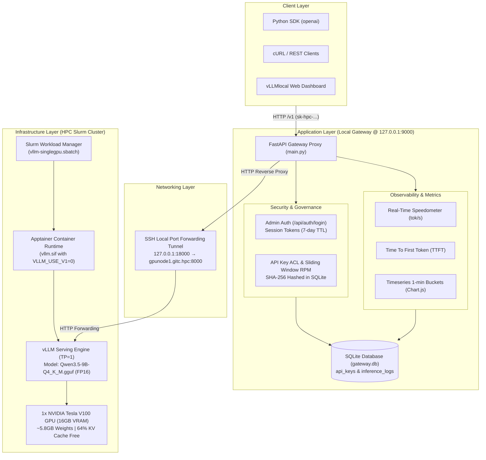
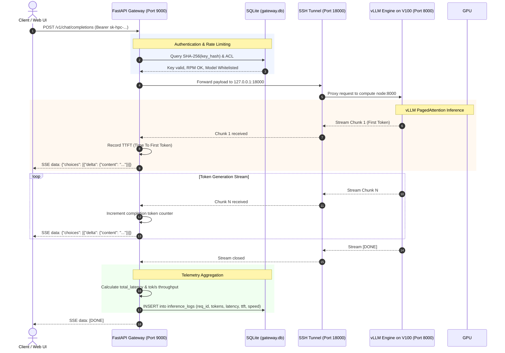
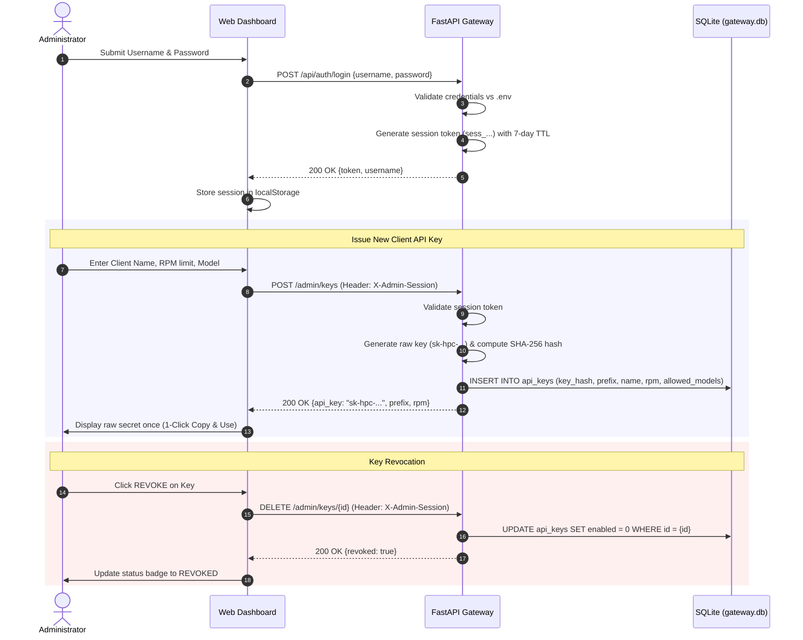

# Local HPC LLM Architecture Overview

This document describes the high-level system architecture, design decisions, component interactions, and data flows for the **vLLMlocal** infrastructure and application stack.

---

## 1. System Architecture Diagram

---

## 2. End-to-End Inference & Telemetry Sequence

The sequence diagram below illustrates the lifecycle of a streaming request from the client, through the Gateway, down to the vLLM engine, including real-time TTFT and token generation speed measurement.

---

## 3. Administrator Authentication & API Key Lifecycle Flow

---

## 4. Key Component Architecture

### 4.1 Infrastructure Layer (`infra/`)
- **Single-GPU Slurm Batch Job (`slurm/serving/vllm-singlegpu.sbatch`)**:
  - Allocates `1` GPU (`#SBATCH --gres=gpu:1`), `4` CPUs, and `32GB` RAM.
  - Launches vLLM with `TP=1`, `--dtype float16`, and `VLLM_USE_V1=0` on NVIDIA Tesla V100 (Volta SM70).
- **Hugging Face Downloader (`slurm/download/hf_download_qwen9b_gguf.sbatch`)**:
  - Automated downloader script that fetches quantized GGUF weights directly onto the shared scratch/lustre storage on compute nodes with automatic checksum verification.

### 4.2 Application Layer (`app/`)
- **FastAPI Gateway Proxy (`app/main.py`)**:
  - OpenAI-compliant reverse proxy supporting streaming Server-Sent Events (SSE) and batch requests.
  - Dual-tier authentication: Admin username/password session auth + Client `sk-hpc-...` bearer tokens.
  - Granular rate limiting (Sliding Window RPM) and per-key model whitelisting.
  - Live token dynamics metrics calculation (`tok/s`, TTFT, prompt & completion token counts).
- **Web UI Dashboard (`ui/index.html`)**:
  - **Inference Telemetry**: Dual-axis Chart.js token timeline, real-time speed meter, live inference audit ledger, and playground.
  - **Slurm Jobs Monitor**: Cluster job queue inspection, node allocation, and live log reader.
  - **AI Chatbot Studio**: Multi-turn chat interface with rich Markdown formatting, syntax highlighting, and 1-click code block copying.
  - **API Key Governance**: Dedicated administration view for token issuance, rate limit configuration, and instant key revocation.
