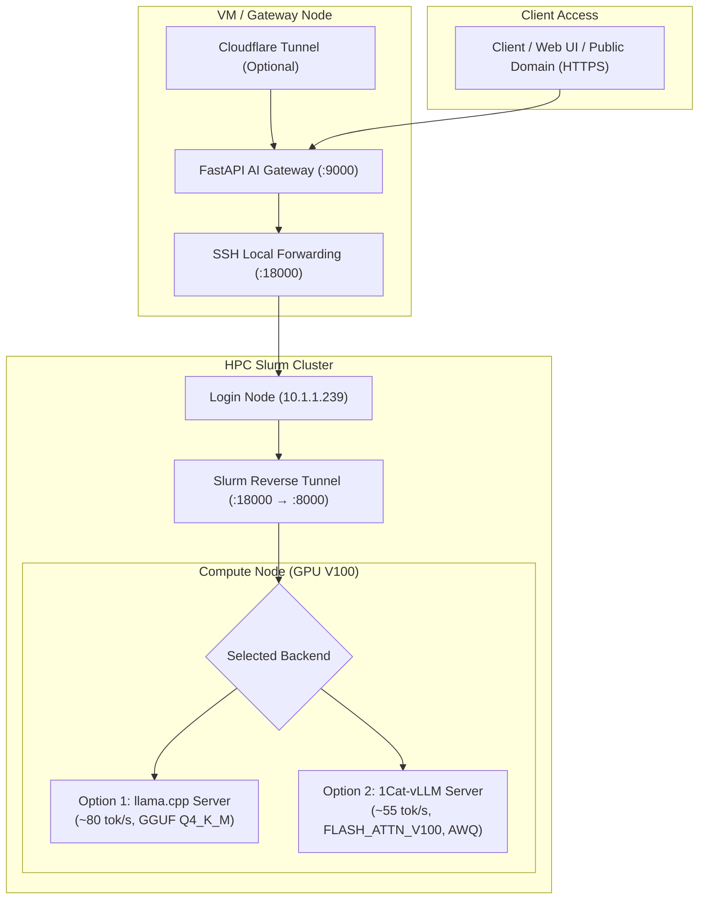

# Deployment Guide: HPC Inference Engines & AI Gateway

This guide covers deploying LLM inference on **NVIDIA Tesla V100 (Volta / SM70)** GPUs in an HPC Slurm cluster using two specialized backends, paired with an AI Application Gateway:

1. **Option 1: `llama.cpp` Backend (~80 tok/s)** — Extreme single-stream throughput using GGUF quantization (`Qwen3.5-9B-Q4_K_M.gguf`).
2. **Option 2: `1Cat-vLLM` Backend (~55 tok/s)** — vLLM engineering fork with `FLASH_ATTN_V100` and TurboMind AWQ (`QuantTrio/Qwen3.5-9B-AWQ`) for continuous batching and prefix caching.

---

## 🏗️ Architecture Overview



---

## ⚡ Backend Performance Comparison (Tesla V100 16GB)

| Feature / Metric | Option 1: `llama.cpp` | Option 2: `1Cat-vLLM` |
| :--- | :--- | :--- |
| **Directory Path** | `infra/llama-cpp/` | `infra/1cat-vllm/` |
| **Model** | `Qwen3.5-9B-Q4_K_M.gguf` | `QuantTrio/Qwen3.5-9B-AWQ` |
| **Quantization** | GGUF (4-bit K-quant) | AWQ (4-bit INT4) |
| **Generation Speed** | **~80 tok/s** 🚀 | **~55 tok/s** ⚡ |
| **VRAM Footprint** | **~5.8 GB** (~64% headroom) | **~7.2 GB** (dynamic KV Cache) |
| **Attention Backend** | Native CUDA / cuBLAS | `FLASH_ATTN_V100` (SM70 TurboMind) |
| **Primary Strength** | Minimal memory, highest single-user speed | Continuous batching, prefix caching, multi-request |

---

## 1. Deploy Option 1: `llama.cpp` Backend (~80 tok/s)

High-speed single-GPU serving via Apptainer with GGUF weights.

### Step 1.1: Download the Model
On the HPC Login Node:
```bash
cd /home/ducledinh/dev/local-llm/infra/llama-cpp
chmod +x download-model.sh
./download-model.sh
```
*Model destination: `/home/ducledinh/dev/models/Qwen3.5-9B-Q4_K_M.gguf` (~5.7GB).*

### Step 1.2: Launch `llama-server` via Slurm
Submit the batch job:
```bash
API_KEY="dacn-qwen-3.5-9b-secret-key" sbatch run_qwen_server.sbatch
```

### Step 1.3: Monitor Startup
```bash
squeue -u "$USER"
tail -f logs/qwen3.5-server-*.out
```
*Wait for: `HTTP server is listening at http://0.0.0.0:8000`.*

---

## 2. Deploy Option 2: `1Cat-vLLM` Backend (~55 tok/s)

Custom vLLM build optimized for NVIDIA Volta V100 (SM70) with `FLASH_ATTN_V100` and TurboMind AWQ.

### Step 2.1: Build the 1Cat-vLLM Apptainer Image
Build the standalone SIF image:
```bash
cd /home/ducledinh/dev/local-llm/infra/1cat-vllm
./build_1cat_vllm_sif.sh
```
*(Or build a writable sandbox for live development: `./make_1cat_vllm_sandbox.sh`)*.

### Step 2.2: Download the AWQ Model
Submit a batch download job or run the interactive downloader:
```bash
# Option A: Slurm Batch Download (Recommended)
sbatch slurm/download/hf_download_qwen3.5_9b_awq.sbatch

# Option B: Interactive Script
./download_awq_model.sh /home/ducledinh/dev/models
```
*Model destination: `/home/ducledinh/dev/models/Qwen3.5-9B-AWQ/`.*

### Step 2.3: Sanity Check GPU & Kernels
Verify CUDA 12.8, PyTorch, and `flash_attn_v100` in the container:
```bash
sbatch slurm/tests/test_flash_attn_v100.sbatch
tail -f logs/test-1cat-v100-*.out
```
*Look for: `1CAT_VLLM_V100_CHECK_COMPLETE`.*

### Step 2.4: Launch 1Cat-vLLM Serving Job
```bash
# Single V100 (TP=1)
sbatch slurm/serving/vllm-1cat-singlegpu.sbatch

# Or run standalone root script:
sbatch run_qwen_1cat.sbatch
```
*Monitor logs: `tail -f logs/1cat-vllm-*.out` until `Uvicorn running on http://0.0.0.0:8000`.*

---

## 3. Establish Secure 2-Hop Network Tunnel

Because HPC Compute Nodes reside behind strict cluster firewalls, a 2-hop reverse SSH tunnel bridges the Gateway to the active compute node.

### 3.1. Sơ đồ luồng mạng & Bảo mật
```text
[AI Gateway (Docker)] ➔ host.docker.internal:18000
       │
       │  [Chặng 2: SSH Local Forward (-L)] (Mã hóa SSH Ed25519)
       ▼
[Login Node: 10.1.1.239] ➔ 127.0.0.1:18000 (Chỉ lắng nghe Localhost)
       │
       │  [Chặng 1: Slurm Reverse Tunnel (-R)] (Tự động trong sbatch)
       ▼
[Compute Node: gpunode1] ➔ localhost:8000 (GPU V100 - sau Firewall)
```

### 3.2. Chặng 1: Tự động hóa Reverse SSH Tunnel trên HPC
Cả hai file `.sbatch` (`run_qwen_server.sbatch` và `vllm-1cat-singlegpu.sbatch`) đã tích hợp sẵn worker kiểm tra `/health` và tự động mở reverse tunnel:
```bash
ssh -N -R 18000:127.0.0.1:8000 $HEADNODE_IP
```

### 3.3. Chặng 2: Kết nối từ VM / Gateway Host
Trên máy **VM / Gateway**, khởi chạy tunnel script:
```bash
cd /home/dev/local-llm/app
./scripts/ssh-tunnel.sh
```

*(Chạy ngầm dưới dạng background service):*
```bash
nohup ./scripts/ssh-tunnel.sh > /tmp/ssh-tunnel.log 2>&1 &
```

---

## 4. Configure & Run AI Local Gateway on VM

### 4.1. Update Model Configuration
Edit `app/config/models.json` to ensure the upstream route points to the local tunnel port (`18000`):

```json
{
    "models": [
        {
            "id": "qwen3.5-9b",
            "upstream_model": "Qwen/Qwen3.5-9B-Instruct",
            "base_url": "http://127.0.0.1:18000/v1",
            "owned_by": "hpc-cluster"
        }
    ]
}
```

### 4.2. Initialize `.env` & Docker Secrets Configuration
Copy the template `.env.example` to `.env` and fill in your details:

```bash
cp .env.example .env
```

Key environment parameters:
```env
# 1. Administrator Dashboard Credentials
ADMIN_USERNAME=admin
ADMIN_PASSWORD=your_super_secret_password
ADMIN_TOKEN=your_super_secret_admin_token

# 2. HPC Supervision Settings (Secured via Docker Secrets)
HPC_SSH_HOST=10.1.1.239
HPC_SSH_USER=ducledinh
HPC_HOST_SSH_KEY=/root/.ssh/id_ed25519
HPC_SSH_KEY=/run/secrets/hpc_ssh_key
HPC_REMOTE_DIR=/home/ducledinh/dev/local-llm/infra
HPC_SLURM_ACCOUNT=summer-school
```

### 4.3. Launch the Gateway
Start the system using Docker Compose:

```bash
docker compose up -d --build
```
*(Or run directly on the host using `./scripts/run.sh` inside `app/`)*.

---

## 5. End-to-End Testing & Verification

1. Access the **Dashboard** at `http://<VM_IP>:9000`.
2. Sign in with your admin credentials.
3. Open the **Inference Playground** tab, select `qwen3.5-9b`, and verify generation output and speedometer.

**Direct cURL test through Gateway:**
```bash
curl http://127.0.0.1:9000/v1/chat/completions \
  -H "Content-Type: application/json" \
  -H "Authorization: Bearer <YOUR_API_KEY>" \
  -d '{
    "model": "qwen3.5-9b",
    "messages": [{"role": "user", "content": "Hello from HPC V100!"}],
    "temperature": 0.7
  }'
```

---

## 6. Expose Gateway with Cloudflare Tunnel (Production)

To expose your Gateway to the internet securely without opening firewall ports or managing SSL certs:

```bash
# 1. Install cloudflared
wget -q https://github.com/cloudflare/cloudflared/releases/latest/download/cloudflared-linux-amd64.deb
sudo dpkg -i cloudflared-linux-amd64.deb

# 2. Authenticate & Create Tunnel
cloudflared tunnel login
cloudflared tunnel create hpc-llm-tunnel

# 3. Route Domain
cloudflared tunnel route dns hpc-llm-tunnel llm.ledinhduc.id.vn
```

Configure `~/.cloudflared/config.yml`:
```yaml
tunnel: <Your-Tunnel-ID>
credentials-file: /home/<user>/.cloudflared/<Your-Tunnel-ID>.json

ingress:
  - hostname: llm.ledinhduc.id.vn
    service: http://localhost:9000
  - service: http_status:404
```

Start the systemd service:
```bash
sudo cloudflared service install ~/.cloudflared/config.yml
sudo systemctl start cloudflared
sudo systemctl enable cloudflared
```

🎉 Service is live and accessible at `https://llm.ledinhduc.id.vn/v1/chat/completions`.
