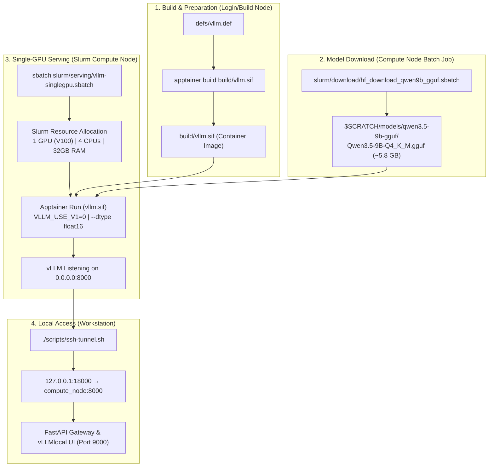
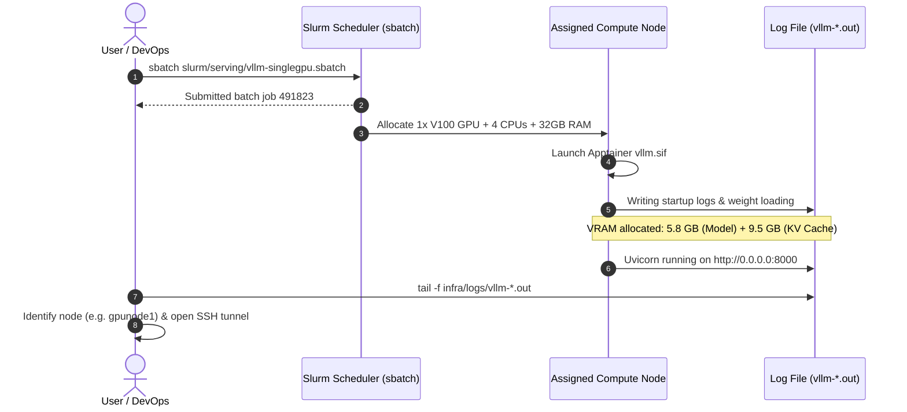

# Infrastructure Deployment & Slurm Guide

This guide details how to build containers, download models, and deploy high-performance LLM inference servers using Slurm, Apptainer/Singularity, and vLLM on an HPC cluster.

---

## 1. HPC Deployment Workflow



---

## 2. Prerequisites & Environment

- **HPC Workload Scheduler**: Slurm Workload Manager.
- **Container Runtime**: Apptainer / Singularity (unprivileged runtime with GPU support `--nv`).
- **Target Hardware**: NVIDIA Tesla V100 (Volta SM70, 16GB / 32GB VRAM).
- **Filesystem**: Shared scratch or NFS filesystem accessible across cluster compute nodes.

---

## 3. Building the Apptainer Container

Build the vLLM container image from the definition file on a build or login node:

```bash
cd infra
mkdir -p build

apptainer build build/vllm.sif defs/vllm.def
```

*Note: The definition file `defs/vllm.def` builds upon `vllm/vllm-openai:v0.8.5.post1` and sets optimal flags for Volta V100 hardware (`VLLM_USE_V1=0`, `NVIDIA_TF32_OVERRIDE=0`, `--dtype float16`).*

---

## 4. Downloading Quantized GGUF Models

To avoid occupying expensive GPU node allocations during downloads, submit a dedicated batch download job:

```bash
cd infra

# Submit job to download Qwen 3.5 9B GGUF (Q4_K_M)
sbatch slurm/download/hf_download_qwen9b_gguf.sbatch
```

The script downloads the quantized GGUF weights directly to `$SCRATCH/models/qwen3.5-9b-gguf/` and automatically verifies file integrity.

---

## 5. Submitting Slurm Inference Jobs



### Job Specifications:
- **GPU Allocation**: 1 GPU (`#SBATCH --gres=gpu:1`)
- **CPU Cores**: 4 Cores (`#SBATCH --cpus-per-task=4`)
- **Memory**: 32 GB RAM (`#SBATCH --mem=32G`)
- **Target Model**: `Qwen3.5-9B-Q4_K_M.gguf`
- **Engine Flags**: `VLLM_USE_V1=0`, `--dtype float16`, `--max-model-len 8192`, `--gpu-memory-utilization 0.90`
- **Serving Port**: `8000` on the allocated compute node.

---

## 6. Monitoring & SSH Tunneling

### 6.1 Check Active Slurm Jobs
```bash
squeue -u $USER
```
Identify the assigned node name (e.g., `gpunode1.gitc.hpc`).

### 6.2 Monitor Real-Time vLLM Server Output
```bash
tail -f infra/logs/vllm-*.out
```
Wait until the log reports:
```
INFO:     Application startup complete.
INFO:     Uvicorn running on http://0.0.0.0:8000 (Press CTRL+C to quit)
```

### 6.3 Establish SSH Tunnel to Local Gateway
From your local machine / gateway host, forward port `18000` to port `8000` on the compute node:

```bash
cd app
GPU_NODE=gpunode1.gitc.hpc LOCAL_PORT=18000 ./scripts/ssh-tunnel.sh
```

---

## 7. Starting Gateway & Web Dashboard

Launch the FastAPI Gateway on your local machine:

```bash
cd app
./scripts/run.sh
```

Access the unified **vLLMlocal** dashboard at `http://127.0.0.1:9000/`.
